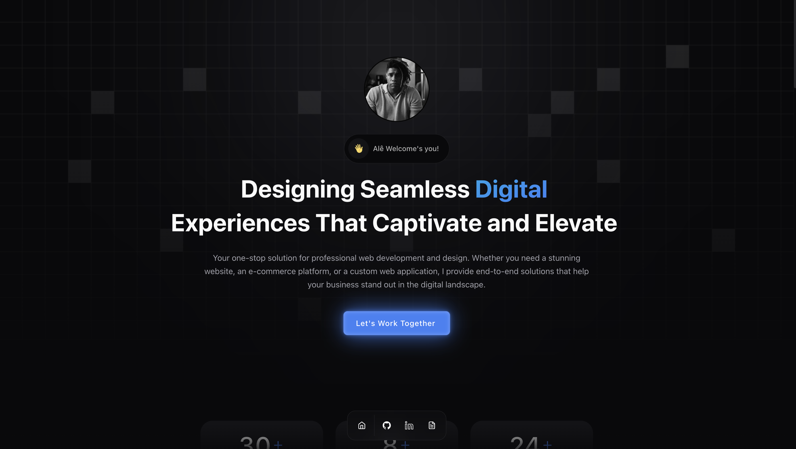

# Alê Nascimento - Front-end Engineer 👨‍💻

Welcome to my portfolio! Explore a collection of projects that highlight my expertise as a Full Stack Developer.

## Tech Stack:

✅ **Frontend**

- Next.js
- Tailwind CSS
- React Query
- Shadcn UI
- Framer Motion
- Mantine

✅ **Backend**

- Hygraph (CMS)
- GraphQL
- Node.js
- Axios

✅ **Tools and Other Technologies**

- Figma
- Git and GitHub

## Let's Connect:

- [LinkedIn](https://www.linkedin.com/in/alexandreal/) - Connect with me on LinkedIn for professional networking.
- [Portfolio Website](https://dynamusdev.vercel.app/) - Explore my portfolio website to learn more about my work.

Feel free to explore the repositories and don't hesitate to reach out for collaboration or any questions!
